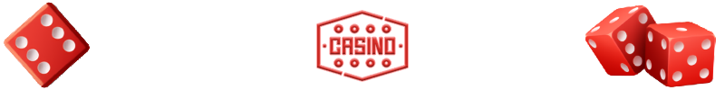
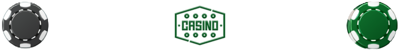

## *НАЗВА ТА ОПИС ПРОЕКТУ*

#### CASINO

Цей сайт - симулятор онлайн-казино, з такими іграми:

- **`Покер на кістках`** - гра на удачу, в якій замість карт використовуються звичайні кістки.
- **`Ігрові автомати`** популярні у світі азартних ігор завдяки своїй простоті та різноманітності тем і стилів.

## *ВСТАНОВЛЕННЯ*

- Для встановлення та налаштування проекту вам знадобляться `Node.js` та `NPM`, встановлені на вашому комп'ютері.
- Щоб встановити залежності, виконайте в терміналі наступну команду: `npm install`
- Щоб запустити проект, скористайтеся командою `npm start`

## *ТЕХНОЛОГІЇ*

Проект складається з Front-end та Back-end частин.

- Front-end: React.js, TypeScript, Redux-Toolkit, Styled-Components та інші
- Back-end: Node.js, TypeScript, Nest, MongoDB та інші

## *ІСТОРІЯ ПРОЕКТУ*

- Проект створювався без чіткого технічного завдання. Ми формували його на основі спільного бачення, розробляючи функціонал та стиль по ходу роботи.
- Не було чіткої структури та дизайну. Стиль і дизайн розроблялися в процесі, відображаючи наш настрій і натхнення на кожному етапі.

## *МЕТА ПРОЕКТУ*

- Нашою метою було створити щось цікаве. У процесі ми навчилися адаптуватися до змін і постійно вдосконалювати проект.

- В результаті у нас вийшло унікальне рішення, яке ми з гордістю представляємо вам сьогодні.

## *РОЗРОБНИКИ*

**`QNeee:`**

  

- Ініціатор проекту та автор його концепції.
- Розробив логіку та функціональність бэкенду та фронтенду.
- Вів управління всім проектом.

**`EfirNet:`**

  

- Займався фронтенд-розробкою, включно зі стилізацією та анімацією інтерфейсу.

----

